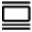

# Content Elements

## Basic Content Elements

-  [Button](Button.md)
-  [Byline](Byline.md)
-  [Headline](Headline.md)

## Structural Content Elements

-  [Columns](Columns.md)
-  [Panel](Panel.md)
-  [Rows](Rows.md)

## Behavioural Content Elements

-  [Accordion](Accordion.md)
-  [Tabs](Tabs.md)
-  [Slider](Slider.md)
